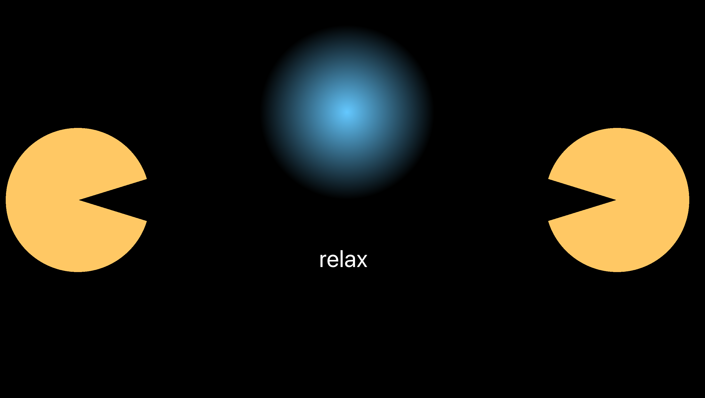
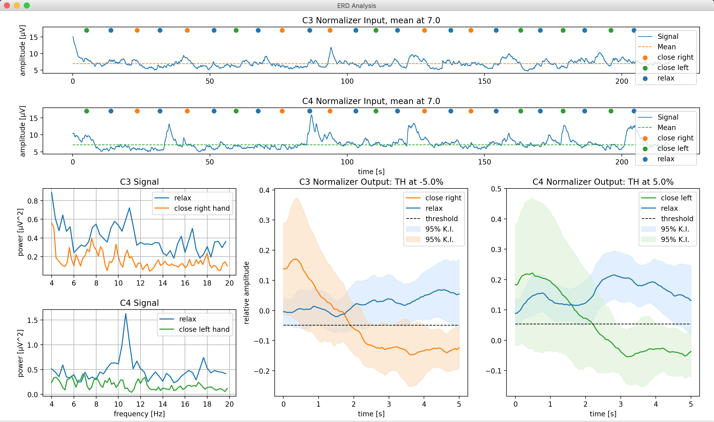

# PythonBCI

### BeamBCI setup guide:

[click here](./setup/instructions.md)


## Description

A python based BCI application that provides the following features:

* automatically controls all applications required to perform a BCI study
* uses Neuropype for signal processing (more info 🠗)
* presents cues and visual/auditory/haptic feedback to the participant
* calculates intermediate results (such as EOG thresholds, EEG reference values, ...)
* applies simple signal processing online (bandpass filters, normalization) based on editable parameters
* stores recorded data in a structured way (based on editable participant code, run number, ...)


## Preview

### GUI to setup and control the study


### visual online feedback



### intermediate analysis results




---
## Getting started with PythonBCI

### First-time setup

1. **NeuroPype**
    * Install Neuropype (not in Windows' "Program Files", since you can't easily change or add files there).
    * Install required third-party libraries as described in [NeuroPype's developer documentation](https://www.neuropype.io/docs/developer) --> Writing a Neuropype Node --> Importing third party libraries:
	    - `spectrum`
            - Currently, the contained `burg.py` needs to be replaced by the file `burg.py` in pythonbci/neuropype_code/
            - Should you get the error that Microsoft Visual C++ 14.0 is required, you can download it [here](http://go.microsoft.com/fwlink/?LinkId=691126&fixForIE=.exe.)
            
	    - `biosppy`

2. **PythonBCI**
    * Run `python-install.bat` to automatically install all required python libraries.


### Running PythonBCI

* Make sure you have the latest version of the folder **exo_nodes** from pythonbci/neuropype_code/ added to Intheon/Neuropype Academic Suite/NeuroPype/neuropype/nodes/. This gives you access to all our custom nodes.
    * To automatize this on Windows, create a symbolic/soft link by running `mklink /D "<path_to_Intheon>\\Neuropype Academic Suite\\NeuroPype\\neuropype\\nodes\\exo_nodes" "<path_to_pythonBCI>\\neuropype_code\\exo_nodes"` from the command line once during setup. Make sure to replace `<path_to...>` with the actual path of your installations.
* Run `run.bat` to start up the PythonBCI GUI.

---

## Developing modules for pythonbci
It is relatively easy to develop your own module that can be used with pythoncbi. A general structure for each module is provided in `./modules/module.py`.
Every module needs to be put in the respective folder in `./modules/` and the file name must end in `<Name>Module.py`.
If it should be a runnable module rather than just a blueprint, the class' constant `MODULE_RUNNABLE` should be set to `True`.
For examples and inspiration you can always look at already available modules.

### Logging
If you want your code to inform the user about the state of the module, operations, etc., you can use the log module.
In your import statements, include the following lines:
```
import log
logger = log.getLogger(__name__)
```
Then, at any place in your code you can use any of the following:
```
logger.debug("This is a debug message (only printed when in debug mode)")
logger.info("This is an info message")
logger.success("Use this to indicate a success")
logger.warning("Warn the user with this, e.g., if they use unusual parameter settings")
logger.error("This is an error message")
logger.log("Some log message", level=log.<LOGLEVEL>)
```

These messages will be printed on the console, but also in the bottom of the pythonbci window.
Make sure to extensively use logging messages to inform the user about what is happening.

## Developing with Neuropype

### Performance trouble shooting
If the update rate of your pipeline is lower than expected (you can check with the EstimateUpdateRate node), try:

1. moving any visualization nodes to a different pipeline (via LSL input and output nodes)
2. connecting the device to a power source. If this helps, consider switching to "High performance" power settings (Settings --> System --> Power & Sleep --> Additional power settings --> Create power plan)
3. setting a higher tick rate, then reopen Pipeline Designer and see if this changes the update rate. If it does, keep repeating this step until you reach the desired update rate or the update rate plateaus

### Installing missing packages
If the python environment that NeuroPype uses (in `Neuropype Academic Suite/NeuroPype/python/python.exe`) does not have the required packages installed, NeuroPype will not start.
For starting with debug messages see instructions below. For installing missing packages (e.g., `spectrum`, `biosppy`) you can use pip. It is important to use NeuroPype's own version of pip here. You can do so as follows:
```commandline
Neuropype Academic Suite/NeuroPype/python/python.exe -m pip install spectrum biosppy
```

### Tips for programming

**Adding nodes**

* Add new nodes to a folder in Intheon/Neuropype Academic Suite/NeuroPype/neuropype/nodes, preferably the **exo_nodes** folder, since this makes it easier for everyone to stay up-to-date.
* NeuroPype server and Pipeline Designer need to be restarted when adding nodes or changing their code.

**Debugging**
* If the NeuroPype server doesn't fully start and the Pipeline Designer won't open, there are major programming bugs in your code (e.g. incorrect constructor (`__init__`) declaration, missing brackets/parentheses etc.).
* To get error messages, start the server from the command line with `"C:\\Intheon\\NeuroPype Academic Suite\\NeuroPype\\python\\python.exe" "C:\\Intheon\\NeuroPype Academic Suite\\NeuroPype\\bin\\servew.py" --error-mode=debug --loglevel=DEBUG`.
* For full-fledged debugging follow the instructions in [Neuropype's developer docs](https://www.neuropype.io/docs/developer) --> Debugging your Pipelines (most features work with Visual Study Code too).
